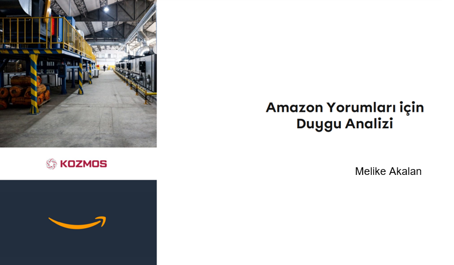
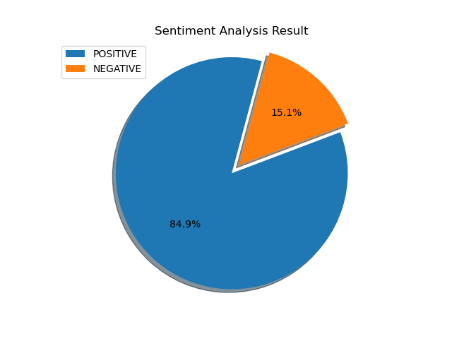
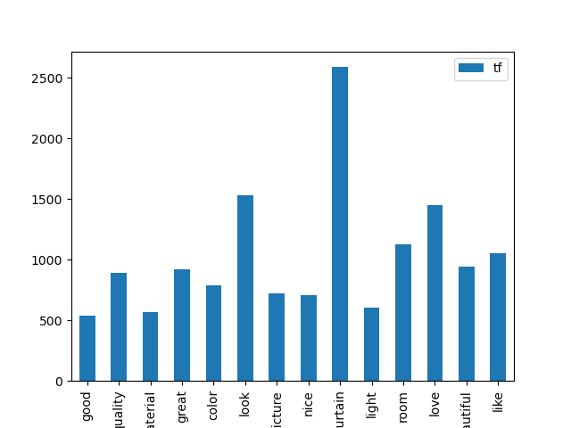
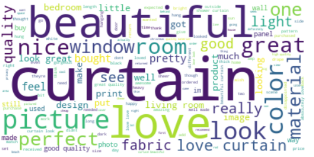

# Kozmos Reviews Sentiment Analysis

 ### Business Problem 
Kozmos, which produces home textiles and daily wear oriented products, which sells through Amazon
increase its sales by analyzing the comments on its products and improving its features according to the complaints it receives.
aims to increase. In line with this goal, the comments will be labeled with a sentiment analysis.
A classification model will be created with the # tagged data.

 ### Dataset Story 
The data set includes the comments, comment title, number of stars and comments for a particular product group.
 consists of variables that indicate how many people find it useful.

 ### Features
 * **Star:** The number of stars given to the product
 * **HelpFul:** Number of people who found the comment helpful
 * **Title:** The title given to the comment content, short comment
 * **Review:** Comment on the product
- Total Features: 4
- Total Row: 5611
- CSV File Size: 489 KB

### Text Preprocessing
* Convert to lower case
* Remove punctations, emojies, and numbers
* Remove stop words and rare words
* Lemmatization

### Data Visualization
- It shows how many percent of tweets are positive or negative.

- Frequent words and their frequencies in the text.

#

#### Wordcloud
WordCloud is a visualization technique for text data wherein each word is picturized with its importance in the context 
or its frequency. This is a very handy application when it comes to understanding the crux of the text. In the WordCloud 
example below, a distribution has occurred according to the most used words among all tweets in the dataset.

